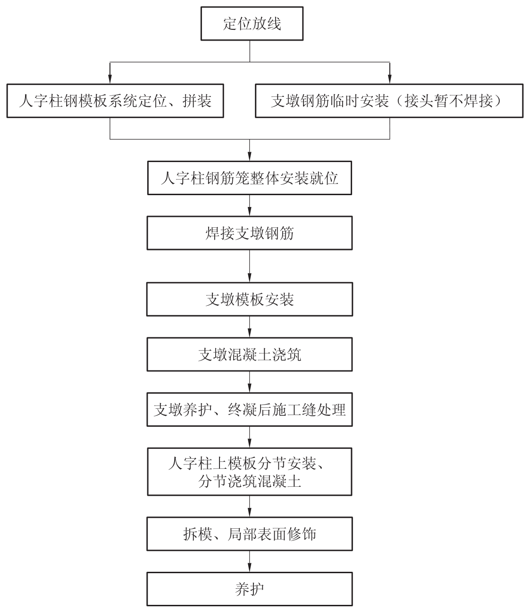
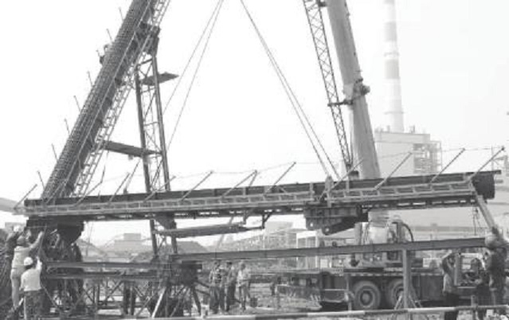
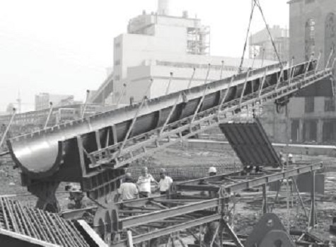
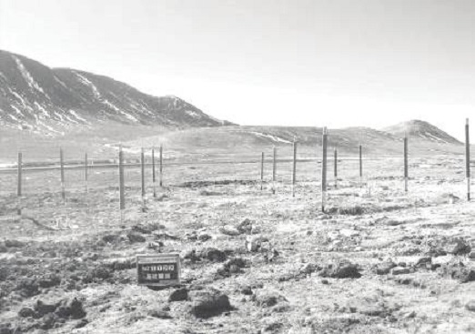

中国电力建设企业协会主编. 中国电力建设工法汇编 2012年度 上[M]. 北京：中国电力出版社, 2012.10:1-11.

http://www.cepca.org.cn/html/1//159/dianlijianshegongfa/2012nian/list-13.html

2012年8月，中电建协[2012]57号文公布，《变径烟囱钢内筒安装施工工法》入选2012年度中国电力建设工法。

# 变径烟囱钢内筒安装施工工法

DJGF-HD-01-2012

中国能源建设集团安徽电力建设第二工程公司

方智炜、俞经河、尹邦义、高恒星、洪刚

# 1前言

烟囱施工是电厂土建总工期和安全、质量的关键。几十年来我国电厂烟囱主要采用钢筋混凝土筒身、砖砌内衬为主的设计，从长期使用效果看，普遍存在筒身混凝土裂缝及内衬砌筑质量不良等问题，影响烟囱的使用寿命。根据以上情况，从20世纪80年代末开始，电厂烟囱设计与施工开始研究应用以钢筋混凝土外筒抗风抗震、内筒为钢筒进行排烟、耐腐蚀的设计。

现有火力发电厂的烟气多为湿法脱硫，而且不设烟气加热系统（GGH），脱硫后的烟气水分含量高、湿度大、温度低、烟气处于全结露现象。烟气中水气结露后形成的具腐蚀性水液主要依附于烟囱内筒内侧壁流下来至专设的排液口排到脱硫系统的废液池中。脱硫处理后的烟气一般还含有氟化氢和氯化物等强腐蚀性物质，烟囱处于腐蚀强度高、渗透性强且较难防范的低温高湿稀酸型腐蚀环境，致使烟囱的运行条件更为恶劣。

目前大型火力发电厂烟囱钢内筒防腐设计趋向于采用钛钢复合板，而钛钢复合板价格昂贵，因此采用钢内筒变径设计，降低工程造价和酸液对内筒壁的腐蚀。

# 2工法特点

1、本工法相对于传统的顶升法（气顶、液压外顶升、液压内顶升）而言，适用于所有形式钢内筒的安装。

2、本工法相对于传统的顶升法，无明显的安全隐患，原理简单，操作简便，安全可靠性高。

3、针对变径钢内筒的结构形式，设计出两套吊耳，利用小吊耳吊装变径段及其以上部分，利用大吊耳吊装其余部分。

4、克服了顶升法中钢内筒与烟道接口处的孔洞不能提前预留的缺点，减少了后续高空作业的安全风险。

5、克服了顶升法中钢内筒不能提前组合成筒体的缺点，减少了在烟囱内部的工作量，缩短了工期。

6、克服了顶升法中内筒与烟道接口处导流板不能提前安装的缺点，减少了后续高空作业的安全风险。

# 3适用范围

适用于电厂的烟囱钢内筒安装，并且具有良好的移植性，对所有形式的钢内筒（自立式、悬挂式、等径式、变径式）都适用，尤其对复杂的悬挂式和变径式优势明显。

# 4工艺原理

钢索式液压提升装置以液压油为动力，推动液压缸活塞往复运动，使与活塞上端相接的上卡紧机构和与缸体下部连接的下卡紧机构之间进行荷载转换，从而提升（或下降）重物。

液压缸活塞往复运动，通过钢绞线传递给吊耳，再通过吊耳传递给内筒筒身，从而实现内筒的整体提升或下降。

# 5施工工艺流程及操作要点

**5.1 施工工艺流程（见图 5.1）**

《变径烟囱钢内筒安装施工工法》施工工艺流程图见图5.1。

图5.1 变径钢内筒安装工艺流程

**5.2操作要点**

1、施工准备

（1）承重平台设计：如钢内筒为悬挂式结构，则烟囱内各层平台必有一层为承重平台，可将此层平台作为液压提升装置的安装平台；如钢内筒为自立式结构，则应与设计单位及时沟通，将烟囱顶部第一层或第二层（从上往下数）设计为承重平台。

（2）钢内筒预制：如钢内筒直径大于烟囱0米门洞宽度，则内筒在加工场分片卷圆后（一般情况三等分），运至烟囱内组合安装。如钢内筒直径小于烟囱0米门洞宽度，则内筒在加工场制作成高度4米的标准筒体，以及其他高度的非标准筒体，运至烟囱内直接安装，见图5.2.1。

图5.2.1 钢内筒预制

（3）液压提升装置调试：钢内筒安装一般采用4套液压提升装置，液压提升装置在安装前，应先在地面进行调试，主要检查液压提升装置同步状况、泵站交流接触器，电磁阀等接触器开闭合状况是否灵敏、计算机控制系统是否完好、提升装置做空缸上升或下降同时卡爪开闭合是否灵敏等。

（4）吊耳设计、制作：根据吊耳的承重量进行吊耳的设计与制作，吊耳开孔穿钢绞线位置应与液压缸穿钢绞线位置在同一铅垂线上，以保证钢内筒在提升过程当中，钢绞线尽量保持垂直。

（5）吊耳的安装位置：钢内筒在整个提升过程当中一般只更换一次吊点，因此根据烟囱内各层钢平台的标高和内筒的实际情况，确定吊耳的安装位置，以保证小吊耳和大吊耳在拆除时位于钢平台上方4米范围内，以确保吊耳能够顺利拆除。大吊耳在拆除位置应距液压缸至少10米以上距离，以消除由于吊耳安装位置偏差导致钢绞线不垂直对液压缸的影响。

2、安装液压提升装置（见图5.2.2）

图5.2.2 安装液压提升装置

（1）利用卷扬机将液压提升装置的油缸和泵站吊装到承重平台就位，按照设备说明书进行固定，并安装相应的油管路和电气控制部分。

（2）泵站与液压缸间采用橡胶软管连接，连接时，须注意一台泵站应与一组液压缸相连，且液压泵站集成块上的符号应与液压缸上的符号一一对应，不允许接错。

（3）各橡胶软管连接时，快换接头处必须用煤油清洗干净，以免将灰尘、杂质带入系统，影响正常工作。各泵站要求安放平稳，不得倾斜，工作时不允许发生剧烈振动。

（4）在油缸周边安装钢绞线导向架，以保证在钢内筒提升过程当中，液压缸上方吐出的钢绞线在1.5米范围内始终保持垂直，然后才能弯曲。弯曲的曲率半径要大于1.5米。同时导向架要有足够的强度、刚度，足以承受吐出的全部钢绞线的重量，并且要使钢绞线在导向架上能保持滚动摩擦，以减少阻力。

3、安装8米内筒

（1）内筒的安装步骤为：内筒运输→内筒对口→焊接→焊缝无损检测→焊缝补漆→内筒提升→下一节内筒对口。

（2）将整体组合的筒体或者分片卷圆的圆弧板运输进烟囱内，利用链条葫芦配合，进行内筒的对口。

（3）对于钛钢复合板钢内筒，则内筒内壁钛板采用钨极氩弧焊，内筒外侧普板采用CO2气体保护焊。对于耐酸钢内筒、普通板钢内筒可采用CO2气体保护焊和手工电弧焊。

（4）对于钛钢复合板钢内筒，则内筒内侧钛板采用着色检验，内筒外侧普板采用超声波检验。对于耐酸钢内筒、普通板钢内筒均采用超声波检验。

4、安装小吊耳（见图5.2.4）

图5.2.4 安装小吊耳

（1）将制作好的小吊耳安装在钢内筒壁板上，焊接牢固。

（2）吊耳安装时，应注意安装精度，吊耳应均匀分布，吊耳开孔穿钢绞线位置应与液压缸穿钢绞线位置在同一铅垂线上，以保证吊耳能够均匀受力。

5、穿钢绞线

（1）根据液压提升装置说明书确定钢绞线规格和数量，根据液压提升装置安装高度确定每根钢绞线的长度，钢绞线计算长度为液压千斤顶提升重物吊点下锚头到千斤顶上方钢绞线导向架1米的距离。

（2）钢绞线在配置时，检查其外形尺寸、表面，应无严重锈蚀，钢绞线在自然状态下有弯折存在时禁止使用，左捻向和右捻向各半。

（3）当实际吊装工况负荷较小时，钢绞线的数量可以减少，但必须在对应位置同时减少，以使液压缸不承受偏心力矩。

（4）在液压千斤顶下方搭好载人的脚手架，钢绞线从液压千斤顶底部往上穿（穿钢索前先将上下卡爪打开）。钢绞线依左右捻向间隔一一穿入。每穿进一根，在上方用上锚头的卡爪锁死，以防止发生钢绞线自由落地的事故。钢绞线全部穿好后，将上下卡爪放下。穿进千斤顶的钢绞线探出钢索导向架的长度以400毫米为宜，且应尽可能均匀。

（5）穿好钢绞线后，将钢绞线梳导板预留牵引绳子，做好防止扭动措施，先临时固定在液压千斤顶的下方。

（6）穿入下锚头的钢绞线一定要十分仔细地检查，使每根钢绞线在液压缸上的位置与下锚座孔位一一对应。钢绞线不准错位，不准中间交叉，不准扭转。在穿入下锚头时先必须把预先准备的钢绞线梳导板，用绳子慢慢牵引梳理，此时，要严防梳导板打转。梳导到下方，钢绞线梳导板的孔位与下卡座孔位对准后，方可将钢绞线一一穿入下锚头锥孔的卡爪中。

（7）每个锚头穿完后，必须立即与吊装件定位，防止下锚头再次打转。当试运行时，内筒离地后，要暂时悬停，再次拧紧下锚头的压板以保安全。

6、提升并安装内筒直至变径段结束

（1）钢内筒的安装，见步骤3。

（2）各吊点的液压千斤顶和液压泵站的布置，以电气控制台为中心，按吊点编号顺序排列就位，液压千斤顶与下锚头吊点的编号应一致，以便统一指挥和操作。

（3）在钢内筒提升过程中，安装人员应时刻注意钢内筒的垂直度，泵站的监护人员要注意工作压力的变化，避免各个油缸受力不均。

（4）在钢内筒提升过程中，一般为四缸同时同步提升。如有不同步现象，可以通过单缸单独提升或两缸单独提升来调整钢内筒的垂直度。调整好后，继续采用四缸同时同步提升。

（5）在钢内筒提升过程中，应安排专人监护吊耳情况，特别在吊耳穿过各层平台时，必须确保吊耳与平台钢梁不能相碰。

7、落下内筒至0米，液压提升装置卸载

（1）液压提升装置做&quot;带负荷下降&quot;动作，钢内筒落下直至0米，用垫铁将内筒与基础之间垫平垫实。

（2）液压提升装置各液压缸完全卸载，钢内筒保持自立。

8、安装大吊耳（见图5.2.8）

图5.2.8安装大吊耳并重穿钢绞线

（1）将制作好的大吊耳安装在钢内筒壁板上，固定牢固。

（2）吊耳安装时，应注意安装精度，吊耳应均布，吊耳开孔穿钢绞线位置应与液压缸穿钢绞线位置在同一铅垂线上，以保证吊耳能够均匀受力。

9、重穿钢绞线

（1）将小吊耳与内筒壁之间的焊缝割除，使小吊耳呈自由状态，液压提升装置做&quot;带负荷下降&quot;动作，直至小吊耳落至0米。

（2）从小吊耳上逐一拆除钢绞线并穿至大吊耳上，保持一一对应关系，以防止钢绞线错位、交叉、扭转。

10、提升并安装内筒直至到顶

（1）钢内筒的安装步骤见步骤3，提升过程见步骤6。

（2）在安装最后一节钢内筒时，应根据烟道口的实际标高来确定最后一节钢内筒的高度，以确保钢内筒安装结束后，烟道口的标高误差在允许范围之内。

11、落下内筒并调整位置（见图5.2.11）

图5.2.11落下内筒并调整位置

（1）液压提升装置做&quot;带负荷下降&quot;动作，钢内筒落下直至0米支座环上，将底部螺栓穿好。

（2）用链条葫芦对筒体做适当调整，以保证烟道口中心的偏差在允许范围之内。

（3）用垫铁将内筒与基础之间垫平垫实。

12、固定钢内筒

（1）如内筒是悬挂式结构，则安装支撑结构并焊接牢固。

（2）内筒与支座环焊接，并紧固底部螺栓。

13、液压提升装置卸载

（1）液压缸完全卸载，内筒保持自立或悬挂。

（2）如内筒设计有伸缩节，则将伸缩节位置内筒筒体割除，安装伸缩节。

14、拆除液压提升装置、钢绞线、吊耳

（1）将大吊耳与内筒壁之间的焊缝割除，临时放置在钢平台上，拆除下锚头钢绞线，利用卷样机将大吊耳分段吊至0米。

（2）用链条葫芦将液压缸上方吐出的钢绞线下垂段拉起，然后打开钢绞线卡爪，用卷扬机逐一抽出钢绞线并放置地面，并利用绞盘将钢绞线成卷捆绑。

（3）液压提升装装置切断电源，拆卸电气控制电缆、油管和电源线，吊运液压千斤顶、液压泵站、电气控制台，卸上下锚头，收整好专用工具。

（4）橡胶软管拆除后，应戴上各自的接头盖，并在接头外部包好塑料袋，以免杂物进入接头。

（5）全部高压油管及控制电缆用轴架卷绕。液压泵站、液压千斤顶等零部件擦净，电气控制台拆卸后再装箱。

**5.3 劳动力组织（见表 5.3 ）**

《变径烟囱钢内筒安装施工工法》劳动力组织情况见表5.3。

表5.3劳动力组织情况

| 序号 | 岗位 | 人数 | 职责 |
| --- | --- | --- | --- |
| 1 | 队长 | 1 | 全面负责全队的管理工作 |
| 2 | 技术员 | 1 | 负责内简安装过程的技术工作 |
| 3 | 安全员 | 1 | 负责内简安装过程的安全工作 |
| 4 | 质检员 | 1 | 负责内筒安装过程的质量工作 |
| 5 | 现场指挥 | 1 | 负责内筒安装过程的现场指挥、协调工作 |
| 6 | 吊笼操作 | 2 | 负责吊笼的操作、保养、维护 |
| 7 | 内筒筒体运输 | 4 | 负责内筒从场外运至烟囱内部 |
| 8 | 内筒安装 | 15 | 负责内筒的组合、焊接工作 |
| 9 | 液压提升装置操作 | 2 | 负责液压提升装置的操作、保养、维护 |
| 10 | 起重指挥 | 2 | 负责内筒提升过程的指挥工作 |
| 11 | 各层平台监护 | 8 | 负责内筒提升过程的监护工作 |
| 12 | 无损检测 | 2 | 负责内筒焊缝的无损检测工作 |
| 合计 | 40 | - |
| 注表中人员为一档作业时的人数，如采取两档轮流作业，则作业人数应加倍。 |

# 6材料与设备

《变径烟囱钢内筒安装施工工法》主要采用的机具设备见表6。

# 7质量控制

**7.1 工程质量控制标准**

1、钢内筒安装施工质量执行《电力建设施工质量验收及评定规程第1部分：土建工程》（DL/T 5210.1—2005）。

2、具体要求：

（1）钢内筒筒身分段安装，见表7.1.2-1。

（2）钢内筒筒身整体安装，见表7.1.2-2。

**7.2 工程质量保证措施**

1、工程质量实行内部三级控制制度，明确各级质检人员的职责，各级部门的负责人同时是质量第一责任人。

2、对原材料进货进行认真检查和复检，确保使用在工程中材料符合设计要求。

3、在安装最后一节钢内筒时，应根据烟道口的实际标高来确定最后一节钢内筒的高度，以确保钢内筒安装结束后，烟道口的标高误差在允许范围之内。用链条葫芦对筒体做适当调整，以保证烟道口中心的偏差在允许范围之内。

4、为确保焊缝质量，采用坡口分层焊接，6个焊工对称布置同步焊接，每焊完一层后，经检查确认无缺陷后，再焊下一层。

# 8安全措施

1、认真贯彻&quot;安全第一，预防为主&quot;的方针，根据国家有关规定、条例，结合施工单位实际情况和工程的具体特点，组成专职安全员和班组兼职安全员以及工地安全用电负责人参加的安全生产管理网络，执行安全生产责任制，明确各级人员的职责，抓好工程的安全生产。

2、施工现场按符合防火、防风、防触电等安全规定及安全施工要求进行布置，并完善布置各种安全标识。

3、各类房屋、库房、料场等的消防安全距离做到符合公安部门的规定，油漆存放于专用危险品库；严格做到不在保温棉堆放区、油漆堆放区、料库等处吸烟；随时清除现场的易燃杂物；不在有火种的场所或其近旁堆放生产物资。

4、氧气瓶与乙炔瓶隔离存放，严格保证氧气瓶不沾染油脂、乙炔发生器有防止回火的安全装置。

5、施工现场的临时用电严格按照《施工现场临时用电安全技术规范》（JGJ 46—2005）的有关规定执行。

6、电缆线路应采用&quot;三相五线&quot;接线方式，电气设备和电气线路必须绝缘良好。

7、配电柜、配电箱前要有绝缘垫，并安装漏电保护装置。

8、建立完善的施工安全保证体系，加强施工作业中的安全检查，确保作业标准化、规范化。

9、作业区内的电源线、油管等，应保护不能阻碍通行和碰撞，内筒提升空间不能有任何障碍物。

10液压提升装置的承载机构具有可靠的自锁性能，如果施工吊装时电源中断、天气突变无法继续工作时，该装置可以承载悬停（负荷转化到下承载机构上），但悬停时间尽可能短，否则有损卡爪寿命。

11、为确保施工作业安全可靠，全套装置关键部件应准备备件，一旦发生故障，以便随时进行检修和更换。

12、在钢内筒提升过程中，按照设备说明书要求，对液压提升装置进行维护和保养。

# 9环保措施

1、成立对应的施工环境卫生管理机构，在工程施工过程中严格遵守国家和地方政府下发的有关环境保护的法律、法规和规章，加强对工程材料、设备、废水、生产生活垃圾、弃渣的控制和治理，遵守有关防火及废弃物处理的规章制度，随时接受相关单位的监督检查。

2、材料堆放要整齐平稳，不得堵塞通道。施工管理员根据工作量的大小来核定领取材料的数量，做到当天领的料当天用完。

3、各种施工垃圾、废料应堆放在指定场所。现场执行&quot;谁干谁清、随做随清&quot;制度，达到&quot;一日一清、一日一净&quot;。

4、机械设备使用前进行检查维修，避免其内部油污泄漏造成污染。

5、含油棉纱棉布、油手套在施工完毕后按危险废弃物如数收回材料库。

# 10效益分析

1、《变径烟囱钢内筒安装施工工法》与其他作业方法相比，钢内筒制作可实行工厂化生产、现场拼接安装。液压提升装置、钢绞线、油缸承重梁以及吊耳可多次周转，使用寿命长，综合经济效益好。

2、采用《变径烟囱钢内筒安装施工工法》与其他作业法相比较，具有原理简单、操作简便、安全可靠性高、适用范围广等特点，特别是针对烟囱钢内筒设计的多元化发展，本工法具有明显的推广价值和发展潜力。

# 11应用实例

**实例 1 ：华能岳阳电厂三期 2×600 兆瓦机组工程烟囱钢内筒安装**

（1）工程概况：该工程烟囱钢内筒为中南电力设计院设计，钢内筒采取自立变径式结构，内筒材质为钛钢复合板，钢内筒高240米，钢内筒总重量约1100吨。

（2）施工情况：该工程使用4台350吨液压提升装置（TX-350-J），内筒施工2010年5月顺利到顶，整个施工过程质量稳定，未发生任何安全事故。

**实例 2 ：皖能马鞍山电厂（ 2×660 兆瓦）&quot;上大压小&quot;扩建工程烟囱钢内筒安装**

（1）工程概况：该工程烟囱钢内筒为中南电力设计院设计，钢内筒采取悬挂变径式结构，内筒材质为钛钢复合板，钢内筒高240米，钢内筒总重量约900吨。

（2）施工情况：该工程使用4台350吨液压提升装置（TX-350-J），内筒施工2011年12月顺利到顶，整个施工过程质量稳定，未发生任何安全事故。

**实例 3 ：皖能铜陵发电厂六期（ 1×1000 兆瓦）&quot;上大压小&quot;改扩建工程烟囱钢内筒安装**

（1）工程概况：该工程烟囱钢内筒为西北电力设计院设计，钢内筒采取悬挂变径式结构，内筒材质为钛钢复合板，钢内筒高240米，钢内筒总重量约600吨。

（2）施工情况：该工程使用4台200吨液压提升装置（GYT-200），内筒施工2010年3月顺利到顶，整个施工过程质量稳定，未发生任何安全事故。

# 自密实混凝土生产和浇筑施工工法

DJGF-HD-02-2012

中国能源建设集团广东省电力第一工程局

蔡天机、吴永森、林锡明、陈笑生

# 1前言

电力工程建设过程中，同一工程中由于混凝土结构形式多变、形状复杂，可复制性的结构较少；大型水池及防火墙等薄壁结构较多；部分结构钢筋较密，振捣困难；工期短，人工费越来越高等原因，在电力工程施工采用自密实混凝土进行结构施工显得很有必要。

# 2工法特点

自密实混凝土与常规浇筑、振捣的混凝土最大的区别在于，它的匀质性、填密性完全靠在自身的重量作用下，能够自流平填密。与常规振捣成型的混凝土相比，自密实混凝土主要有以下几个特点：

1.自密实混凝土由于免振，可节省劳动力和电力，提高施工效率。

2.改善工作环境，免除振捣所产生的噪声给环境及劳动工人造成的危害。

3.增加了结构设计的自由度，可用于浇筑成型形状复杂、薄壁和配筋密集的结构。

4.有效解决传统混凝土施工中漏振、过振，避免了振捣对模板冲击移位的问题。

5.大量利用工业废料做掺和料，降低混凝土水化热，提高混凝土耐久性。

6.降低工程总体造价，从提高施工速度，减少操作工人，延长模板使用寿命，结构设计优化等方面降低工程成本。

# 3适用范围

自密实混凝土可作为电力工程及一般建筑工程的钢筋混凝土、预应力混凝土和素混凝土。适用于大体积工程混凝土、轻型薄壁结构、形状复杂及钢筋密集的框架梁柱及料仓、漏斗、二次注浆等。

# 4工艺原理

配制自密实混凝土的原理是通过外加剂、胶结材料和粗细骨料的选择与搭配和精心的配合比设计，将混凝土的屈服应力减小到足以被因自重产生的剪应力克服，使混凝土流动性增大，同时又具有足够的塑性黏度，令骨料悬浮于水泥浆中，不出现离析和泌水问题，能自由流淌并充分填充模板内的空间，形成密实且均匀的胶凝结构。因此，在配制中主要应采取以下措施：借助以萘系高效减水剂为主要组分的外加剂，可对水泥粒子产生强烈的分散作用，并阻止分散的粒子凝聚，使混凝土拌和物的屈服应力和塑性黏度降低。高效减水剂的减水率应不低于25%，并且应具有一定的保塑功能。

掺加适量矿物掺和料能调节混凝土的流变性能，提高塑性黏度，同时提高拌和物中的浆—固比，改善混凝土和易性，使混凝土匀质性得到改善，并减少粗细骨料颗粒之间的摩擦力，提高混凝土的通阻能力。

掺入适量混凝土膨胀剂，减少混凝土收缩，提高混凝土抗裂能力，同时提高混凝土黏聚性，改善混凝土外观质量。适当增加砂率和控制粗骨料粒径不超过20mm，以减少遇到阻力时浆骨分离的可能，增加拌和物的抗离析稳定性。在配制强度等级较低的自密实混凝土时可适当使用增稠剂以增加拌和物的黏度。

# 5工艺流程及操作方法

## 工艺流程

混凝土原材料选择→混凝土配合比设计→配合比现场检验→作业条件准备→模板工程→混凝土拌制→混凝土运输→混凝土浇筑→混凝土养护→混凝土保护。

## 操作方法

**1.自密实混凝土配合比设计及现场检验**

**（1）自密实混凝土配合比设计**

普通混凝土配合比设计方法，均是依据JGJ 55—2011《普通混凝土配合比设计规程》的要求，根据不同强度等级要求进行混凝土配合比强度设计。但对于自密实混凝土就不太适用，配制自密实混凝土应首先确定混凝土配制强度、水胶比、用水量、砂率、粉煤灰掺量、膨胀剂等主要参数，再经过混凝土性能试验强度检验，反复调整各原材参数来确定混凝土配合比。

自密实混凝土配合比的突出特点是：高砂率、低水胶比、高矿物掺和料掺量。宜采用增加胶凝材料的方法适当增加浆体体积或添加外加剂的方法来改善浆体的黏聚性和流动性。

自密实混凝土配合比设计宜采用绝对体积法。自密实混凝土水胶比宜小于0.42，胶凝材料用量宜控制在450～550kg/m3。

自密实混凝土配合比设计时采用的原材料应与施工现场使用的材料相符。

**（2）自密实混凝土配合比的现场检验（试拌、调整与确定）**

①混凝土试配时应采用工程实际使用的原材料，每盘混凝土的最小搅拌量不宜小于25L。

②试配时，首先应进行试拌，然后检查拌和物自密实性能必控指标，再检查拌和物自密实性能可选指标。当试拌得出的拌和物自密实性能不能满足要求时，应在水胶比不变、胶凝材料用量和外加剂用量合理的原则下调整胶凝材料用量、外加剂用量或砂的体积分数等，直到符合要求为止。然后提出供混凝土强度试验用的基准配合比。

③混凝土强度试验时至少应采用三个不同的配合比。当采用不同的配合比时，其中一个应为基准配合比，别外两个配合比的水胶比宜较基准配合比分别增加和减少0.02；用水量与基准配合比相同，砂的体积分数可分别增加或减少1%。

④制作混凝土强度试验试件时，应验证拌和物自密实性能是否达到设计要求，并以结果作为代表相应配合比的混凝土拌和物的性能。

⑤进行混凝土强度试验时，每种配合比至少应制作一组（三块）试件，标准养护到28d或设计强度要求的龄期时试压，也可同时多制作几组试件，按《早期推定混凝土强度试验方法标准》（JGJ/T 15—2008）早期推定混凝土强度，用于配合比调整，但最终应满足标准养护28d或设计规定龄期的强度要求。如有耐久性要求时，还应检测相应的耐久性指标。

⑥根据试配结果对基准配合比进行调整，直至拌和物自密实性能和硬化后混凝土性能都满足相应规定为止，获得生产配合比。

⑦对于应用条件特殊的工程，可对确定的配合比进行模拟试验，以检验所设计的配合比是否满足工程应用条件。

**2.作业条件准备**

（1）混凝土配合比确定后，在现场按照施工方案做样板试件，通过样板试件对混凝土配合比以及施工工艺等进行验证，积累相关经验后进行详细的技能培训和技术交底，使每名施工人员都熟悉操作规程和职责。

（2）所有物资、机具、人员都准备完毕。

（3）预检、隐检等各种验收全部完成。

**3.模板工程**

（1）模板及其支撑设计应符合现行行业标准《建筑施工模板安全技术规范》（JGJ 162—2008）规定，其中新浇筑混凝土对模板的最大侧压力按_γ __c__ H_（液体压力）计算。

（2）模板的支撑立柱应置于坚实的地（基）面上，模板体系应具有足够的承载能力、刚度和稳定性，能可靠地承受浇筑混凝土的自重、侧压力、风荷载及施工荷载。

（3）对外观有严格要求的现浇或预制构件，应严格选择模板的材质和脱模剂种类。

（4）成型的模板应拼装紧密，不得漏浆，并能保证构件尺寸、形状正确：①斜坡面混凝土的外斜坡表面应支设模板。②混凝土上表面模板应有抗自密实混凝土浮力的措施。③浇筑形状复杂或封闭模板空间内混凝土时，应在模板上适当部位设置排气口和浇筑观察口。

（5）模板及其支架拆除的顺序及安全措施应按施工技术方案执行。

（6）拆模时间应符合现行国家标准《混凝土结构工程施工质量验收规范》（GB 50204—2002）要求，对薄壁、异型等构件宜延长拆模时间。

**4.混凝土拌制与运输**

（1）生产自密实混凝土必须使用强制式搅拌机。混凝土原材料均按重量计量，每盘混凝土计量允许偏差为水泥±1%，矿物掺和料±1%，粗细骨料±2%，水±1%，外加剂±1%。

（2）搅拌机投料顺序为先投细骨料、水泥及掺和料，然后加水、外加剂及粗骨料。应保证混凝土搅拌均匀，适当延长混凝土搅拌时间，搅拌时间宜控制在90～120s。加水计量必须精确，应充分考虑骨料含水率的变化，及时调整加水量。

（3）砂、石骨料级配要稳定，供应充足，筛砂系统用孔径不超过20mm的钢丝网，滤除其中所含的卵石、泥块等杂物，每班不少于两次检测级配和含水率，并及时调整含水率。骨料露天堆放情况下，雨天不宜生产施工，防止含水率波动过大，混凝土性能不易控制。

（4）每次混凝土开盘时，必须对首盘混凝土性能进行测试，并进行适当调整，直至混凝土性能符合要求，才能确定混凝土的施工配合比。

（5）在自密实混凝土生产过程中，除按规范规定取样试验外，对每车混凝土应进行目测检验，不合格混凝土严禁运至施工现场。

（6）自密实混凝土的长距离运输应使用混凝土搅拌车，短距离运输可利用现场的一般运输设备。必须严格控制非配合比用水量的增加。搅拌车在装入混凝土前必须仔细检查，筒体内应保持干净、潮湿，不得有积水、积浆。

（7）在运输过程中严禁向车筒内加水，应确保混凝土及时浇筑与供应，合理调配车辆并选择最佳线路尽快将混凝土运送到施工现场，对超过120min的混凝土，司机必须及时将情况反映给技术人员，并对混凝土进行检查。

（8）高温施工时，生产自密实混凝土原材料入机温度应符合表5.5.8规定，必要时应对原材料采取控温措施。

表5.5.8 原材料最高入机温度

| 原材料 | 最高入机温度（℃） | 原材料 | 最高入机温度（℃） |
| --- | --- | --- | --- |
| 水泥 | 60 | 水 | 20 |
| 骨料 | 30 | 粉煤灰等掺和料 | 60 |

（9）冬期施工时，宜对拌和水、骨料进行加热，但拌和水温度不宜超过60℃、骨料不宜超过40℃；水泥、外加剂、掺和料不得直接加热。

**5.混凝土浇筑**

（1）混凝土输送管路应采用支架、毡垫、吊具等加以固定，不得直接与模板和钢筋接触，除出口外其他部位不宜使用软管和锥形管。

（2）混凝土搅拌车卸料前应高速旋转60～90s，再卸入混凝土泵，以使混凝土处于最佳工作状态，有利于混凝土自密实成型。

（3）泵送时应连续泵送，必要时降低泵送速度，当停泵超过90min，则应将管中混凝土清除，并清洗泵机。泵送过程中严禁向泵槽内加水。

（4）在非密集配筋情况下，混凝土的布料间距不宜大于10m，当钢筋较密时布料间距不宜大于5m。每次混凝土生产时，必须由专业技术人员在施工现场进行混凝土性能检验，主要检验混凝土坍落度和坍落扩展度，并进行目测，判定混凝土性能是否符合施工技术要求，发现混凝土性能出现较大波动，及时与搅拌站技术人员联系，分析原因及时调整混凝土配合比。

（5）泵送卸料时，在墙体附近搭设架子，采用可供卸料的专用料斗放料，不宜直接入料，防止对模板的冲击太大，出现模板移位。

（6）浇筑时下料口应尽可能的低，尽量减少混凝土的浇筑落差，在非密集配筋情况下，混凝土垂直自由落下高度不宜超过5m，从下料点水平流动距离不宜超过10m。对配筋密集的混凝土构件，垂直自由落下高度不宜超过2.5m。

（7）混凝土应采取分层浇筑，在浇筑完第一层后，应确保下层混凝土未达到初凝前进行第二次浇筑。

（8）如遇到墙体结构配筋过密，混凝土的黏聚性较大，为保证混凝土能够完全密实，可采用在模板外侧敲击或用平板振捣器辅助振捣方式来增加混凝土的流动性和密实度。

（9）浇筑速度不要过快，防止卷入较多空气，影响混凝土外观质量。在浇筑后期应适当加高混凝土的浇筑高度以减少沉降。

（10）自密实混凝土应在其高工作性能状态消失前完成泵送和浇筑，不得延误时间过长，应在120min内浇筑完成。

（11）高温施工时，混凝土入模温度不宜超过35℃；冬期施工时，混凝土入模温度不宜低于5℃。

（12）大体积自密实混凝土入模温度宜控制在30℃以下；混凝土在入模温度基础上的绝热温升值不宜大于50℃，混凝土的降温速率不宜大于2.0℃/d。

**6.混凝土养护与保护**

（1）应综合考虑自密实混凝土性能、现场条件、环境温湿度、构件特点、技术要求、施工操作等因素制订养护方案。

（2）自密实混凝土浇筑完毕，应及时采用覆盖、蓄水、薄膜保湿、喷涂或涂刷养护剂等养护措施，养护时间不得少于14d。

（3）大体积自密实混凝土养护措施应符合设计要求，当设计无具体要求时，应符合现行国家标准《大体积混凝土施工规范》（GB 50496—2009）的有关规定。对裂缝有严格要求的部位应再适当延长养护时间。

（4）对于平面结构构件，混凝土浇筑收浆和抹压后，应及时采用塑料薄膜覆盖严密，并保持塑料薄膜内有凝结水。混凝土强度达到1.2N/mm 2后，用麻袋或草袋覆盖浇水养护，条件许可时宜蓄水养护。

（5）垂直结构构件拆模后，表面宜用麻袋或棉被覆盖并浇水养护，也可涂刷养护剂。

（6）冬期施工不能向裸露部位的自密实混凝土直接浇水养护，应用保温材料和塑料薄膜进行保温、保湿养护，保温材料的厚度应经热工计算确定。

# 6材料与设备

## 材料

**1.胶凝材料**

（1）水泥应符合现行国家标准《通用硅酸盐水泥》（GB 175—2007）的规定；当采用其他品种水泥时，其性能指标应符合相应标准的规定。

（2）粉煤灰、粒化高炉矿渣粉、硅灰等矿物掺和料，其性能指标应符合国家现行相关标准的要求。当采用其他掺和料时，应通过充分试验进行验证。

**2.骨料**

（1）粗骨料宜采用连续级配或2个及以上单粒径级配搭配使用，最大公称粒径不宜大于20mm；对于结构紧密的竖向构件、复杂形状的结构以及有特殊要求的工程，粗骨料的最大公称粒径不宜大于16mm。粗骨料的针片状颗粒含量、含泥量及泥块含量，应符合表6.1.2-1的要求，其他性能及试验方法应符合现行行业标准《普通混凝土用砂、石质量及检验方法标准》（JGJ 52—2006）中的相关规定。

表6.1.2-1 粗骨料的性能指标

| 项目 | 针片状颗粒含量 | 含泥量 | 泥块含量 |
| --- | --- | --- | --- |
| 指标 | ≤8% | ≤1.0% | ≤0.5% |

（2）轻粗骨料宜采用连续级配，性能指标应符合表6.1.2-2的要求，其他性能及试验方法应符合现行国家标准《轻集料及其试验方法第1部分：轻集料》（GB/T 17431.1—2010和行业标准《轻骨料混凝土技术规程》（JGJ 51—2002）中的相关规定。

表6.1.2-2 轻粗骨料的性能指标

| 项目 | 密度等级 | 最大粒径 | 粒型系数 | 24h吸水率 |
| --- | --- | --- | --- | --- |
| 指标 | ≥700 | ≤16mm | ≤2.0 | ≤10% |

（3）细骨料宜选用级配Ⅱ区的中砂，天然砂的含泥量、泥块含量应符合表6.1.2-3的要求；人工砂的石粉含量应符合表6.1.2-4的要求，当人工砂中含泥量很低（MB≤1.0），在配制C25及以下混凝土时，经试验验证能确保混凝土质量后，其石粉含量可放宽到15%。试验应按现行行业标准《普通混凝土用砂、石质量及检验方法标准》（JGJ 52—2006）中的相关规定进行。

表6.1.2-3 天然砂的含泥量和泥块含量指标

| 项目 | 含泥量 | 泥块含量 |
| --- | --- | --- |
| 指标 | ≤3.0% | ≤1.0% |

表6.1.2-4 人工砂的石粉含量

| 项目 | 指标 |
| --- | --- |
| ≥C60 | C55～C30 | ≤C25 |
| 石粉含量 | MB＜1.4（合格） | ≤5.0% | ≤7.0% | ≤10.0% |
| MB≥1.4（不合格） | ≤2.0% | ≤3.0% | ≤5.0% |

**3.外加剂**

（1）外加剂宜选用高性能减水剂或高效减水剂。外加剂性能应符合现行国家标准《混凝土外加剂》（GB 8076—2008）和《混凝土外加剂应用技术规范》（GB 50119—2003）中的相关规定。

（2）掺用改善拌和物性能的其他外加剂时，应通过充分试验进行验证，其性能应满足现行相关标准的要求。

（3）掺用膨胀剂时，其性能应符合现行国家标准《混凝土膨胀剂》（GB 23439—2009）中的相关规定。

**4.拌和用水**

自密实混凝土拌和用水应符合现行行业标准《混凝土用水标准》（JGJ 63—2006）的相关规定。

## 设备

（见表6.2）

表6.2 设备

| 序号 | 名称 | 规格型号 | 数量 |
| --- | --- | --- | --- |
| 1 | 搅拌站搅拌设备 | - | 数量根据现场工作量定 |
| 2 |
| 3 |
| 4 |
| 5 |
| 6 |
| 7 |
| 8 |
| 9 |
| 10 |
| 11 |
| 12 |
| 13 |

# 7质量控制

## 质量检验

1.自密实混凝土拌和物除应检验氯离子总含量等普通混凝土检验项目外，还应检验自密实性能指标，检验应符合下列规定：

（1）混凝土自密实性能指标检验应包括坍落扩展度和T50扩展时间，其他自密实性能指标检验及频率按合同规定进行。

（2）出厂坍落扩展度和T50扩展时间检验时，同配合比的混凝土检验不应少于1次；当一个工作班相同配合比的混凝土不足50m3时，其取样检验不得少于1次。

（3）交货时的自密实混凝土坍落扩展度和T50扩展时间检验频率应与强度检验频率一致。

（4）实测坍落扩展度应符合设计要求，混凝土拌和物不得发生外沿泌浆和中心骨料堆积现象。

2.对掺引气型外加剂的自密实混凝土拌和物应检验其含气量，含气量检验应符合相关标准和合同的规定。

3.自密实混凝土应进行抗压强度试验，其试件留置方法和数量应按现行国家标准《混凝土结构工程施工质量验收规范》（GB 50204—2002）执行。

4.对有设计要求耐久性的自密实混凝土，还应检验相关耐久性项目，其试件留置方法和数量应符合现行行业标准《混凝土耐久性检验评定标准》（JGJ/T 193—2009）的规定。

5.拌和物的其他性能试验方法应按现行国家标准《普通混凝土拌和物性能试验方法标准》（GB/T 50080—2002）的相关规定执行。自密实混凝土的力学性能、长期性能和耐久性能应分别按现行国家标准《普通混凝土力学性能试验方法标准》（GB/T 50081—2002）和《普通混凝土长期性能和耐久性能试验方法标准》（GB/T 50082—2009）相关规定执行。

## 检验评定

1.自密实混凝土强度应按现行国家标准《混凝土强度检验评定标准》（GB/T 50107—2010）的规定分批检验评定，并应满足设计要求。

2.自密实混凝土耐久性能应按现行国家标准《混凝土耐久性检验评定标准》（JGJ/T 193—2009）的规定检验评定，并应满足设计要求。

## 工程验收

自密实混凝土验收应按现行国家标准《混凝土结构工程施工质量验收规范》（GB 50204—2002）的规定执行。

# 8安全措施

1.现场管理人员必须十分重视安全生产，牢固树立安全促进生产、生产必须安全的思想，切实做好预防工作。所有施工人同必须经安全培训，考核合格方可上岗。

2.施工员在下达技术交底的同时，应下达具体的安全交底，并讲明安全注意事项。

3.落实安全施工责任制度，并落实到岗位，责任到人。防水混凝土施工期间应以漏电保护、防机械事故和保护为安全工作重点，振捣人员必须戴好绝缘手套，切实做好防护措施。遵章守纪，杜绝违章指挥和违章作业，现场设立安全措施及有针对性的安全宣传牌、标语和安全警示标志。进入施工现场必须佩戴安全帽，作业人员衣着灵活紧身，禁止穿硬底鞋、高跟鞋作业，高空作业人员应系好安全带，禁止酒后操作、吸烟和打架斗殴。

# 9环保措施

1.严格按施工组织设计要求合理布置工地现场，做到车辆出入停靠有序，材料堆放整齐，标识清楚，施工环境文明。

2.做好安全防火工作，严禁工地现场吸烟或其他不文明行为。

3.注意施工废水排放，防止造成下水管道堵塞。

# 10效益分析

## 社会效益

1.自密实混凝土由于免振，可节省劳动力和电力，提高施工效率，可以缩短施工工期。

2.可以消除因振捣而带来的噪声，改善工作环境，免除振捣产生的噪声给环境及劳动工人造成危害。

3.大量利用工业废料做掺和料，改善混凝土性能，同时减少水泥的用量，降低混凝土成本，节约能源，改善环境，能够带动混凝土等相关产业的发展。

## 经济效益

1.可以缩短施工工期，节约大量劳动力，由此而带来的经济效益十分可观。

2.延长模板使用寿命，结构设计优化等方面降低工程成本。

3.大量利用工业废料做掺和料，取代部分水泥，其节约成本比较直观。

# 11应用实例

1.国电泉州南埔电厂（2×670MW）二期工程主厂房基础、厂房框架及楼板、汽轮机底板及机座、锅炉基础及集控楼基础等C25以上强度等级的混凝土结构，使用方量为26000m3。

2.茂名热电厂（1×600MW）&quot;上大压小&quot;燃煤发电工程主厂房基础、厂房框架及楼板、汽轮机底板及机座、锅炉基础及水塔等C25以上强度等级的混凝土结构，使用方量为34000m3。

3.韶关发电厂&quot;上大压小&quot;燃煤机组工程（2×600MW）主厂房基础、汽轮机底板、锅炉基础及集控楼基础、水塔基础等C25以上强度等级的混凝土结构，使用方量为50423m3。

# 冷却塔人字柱现浇移动式钢模板体系施工工法

DJGF-HD-03-2012

上海电力建筑工程公司

唐超群、奚风、柏斯海、陈耀华、戴国霖

# 1前言

随着我国电力工业的高速发展，以及节能环保要求不断提高，淋水面积超过10000m2的超大冷却塔已越来越多冷却塔人字柱的直径、长度也在不断地增加，单根人字柱重量也随之变大，从原先的10t左右发展到现在的20t甚至更大，现场的机械已无法满足预制吊装的工艺或成本的成跳跃式增长，为此国内很多公司都采用满堂脚手架现浇的施工工艺，但随之而来的是劳动力的增加、高空作业等危险源的增加、工期变长以及质量不可控等现象。

根据目前行业的情况以及市场的人工工资的增长情况，上海电力建筑工程公司对大型冷却塔人字柱现浇施工工艺进行革新，寻找出一种安全、质量有保障，又能减少工期，减少用工量的施工工艺；以田集电厂二期工程、国电九江电厂冷却塔项目工程为依托，研发了移动式人字柱现浇钢模板体系，打破了常规冷却塔人字柱现浇采用排架进行支撑的方式，并获得了两项实用新型专利《冷却塔混凝土立柱现浇全钢模板体系》（专利号：ZL201020637927.3）和《混凝土全钢模板脱模装置》（专利号：ZL201120253713.0）。

在正式使用该套体系前，上海电力建筑工程公司还邀请了专家组对施工方案及关键技术进行评审，专家们一直认为该施工体系具有&quot;结构设计合理、技术先进、显著的综合技术经济效益等特点，具有创新性，为国内首创&quot;，并提出些合理化建议，为施工的顺利进行提供了宝贵意见。

现已运用于国电九江发电厂冷却塔项目工程中，综合资料显示该体系强度、刚度和稳定性满足规范要求，工艺设施满足安全、质量的要求，达到了预期效果。

# 2工法特点

1.该钢模具体系现场定位快速、准确，操作简单，借鉴了吊车的单元式组件及销轴连接方式，提高了安装的速度；另设计与制作中对组装的简便性及互换性作了充分的考虑，从而降低了对劳动力素质的要求。

2.运用该工法，对人字柱的垂直角度、直线度、截面尺寸均可通过控制模具得以实现，将现场的监控工作转移至工厂内，质量精度可达毫米级，质量控制更有保障，并减少监控环节以及多环节的累计误差。

3.进度方面可控，且效率较高，较传统的满堂脚手架方式单人字柱这一分项工程可缩短近一个月，并减少了用工。

4.相比传功工艺，该工法的大多数工作均在地面完成，仅有上模安装及钢筋笼吊装在高空完成，且作业环境安全设施齐全，工人的安全有了更大保障。

# 3适用范围

本工法适用于类似于冷却水塔人字柱的倾斜型混凝土结构的现浇施工。

# 4工艺原理

该工法所用的钢模板体系分为支座小车桁架、模具体系以及稳定系统，其中模具体系分为模具、斜支撑及下横梁。

模具体系即为人字柱的模板支撑体系，模具两侧设置爬梯，在各施工地点、混凝土浇筑点均设置平台和栏杆；同时模具体系为一独立体系，可以在支座小车桁架上前后移动，便于人字柱混凝土达到拆模强度后拆模。

人字柱钢筋采用预绑扎后，整体吊装，以钢模板体系为基准就位。

# 5施工工艺流程及操作要点

## 工艺流程

（见图5.1）

图5.1 施工工艺流程图

## 操作要点

1.定位放线

利用CAD放样，按照小车定位的相关尺寸，确定出小车定位控制点的坐标。再根据现场已有的测量基准点，利用全站仪放出小车定位控制点。小车放样尺寸见图5.2.1，图中A1点为半径61 864mm处的支墩中心点，C1、c1点分别为两个人字柱中心线与环基面的交点。通过上图中的F1、G1、f1、g1四点定位两部支座小车，而后将前后&quot;八字&quot;抛锚临时固定。

图5.2.1 小车定位尺寸图

2.支座小车调平

支撑小车调平采用4支腿上的丝杆进行调整，将支座小车调整至设计标高后（见图5.2.2），即可拉设&quot;八字&quot;抛锚，再安装下模具及斜支撑系统。

图5.2.2 4支腿标高调整

3.模具支撑系统安装

（1）起吊下横梁、斜撑杆，将其平放在支座下车上，并将相关销轴连接；通过四点起吊组装好的下模板，使得下模板连接耳板与下横梁通过销轴连接，缓慢落下下模板，使下模板放置在斜撑杆的枕木上。见图5.2.3-1。

图5.2.3-1下模具吊装就位图

（2）换短头钢丝绳，并通过卸扣与模板顶部两个吊耳连接，起吊下模板，缓慢提升下模板。见图5.2.3-2。

5.2.3-2下模具起板

（3）缓慢提升下模板，当斜撑杆端部耳板插入下模板连接耳板，用撬棒将斜撑杆端部耳板销孔与下模板连接耳板销孔对齐，穿上销轴。

至此整个模具体系已安装完成，由于模具是工厂法制作，所有的定位、误差校正均在工厂内完成，现场只需控制好平面定位即可。

4.支墩钢筋临时安装

（1）对环基上的支墩插筋位置进行复核，按照设计图纸将支墩的各部位钢筋临时就位，接头待人字柱钢筋就位好后再进行焊接。

（2）由于上支墩面层钢筋、柱钢筋规格大且较密，支墩面层钢筋按正常顺序摆放，与大多数人字柱主筋相碰，为节约人字柱钢筋笼的就位时间，需要将支墩面层钢筋位置作调整，使柱主筋与面层钢筋错开。

5.钢筋笼吊装

待模具就位后即可吊装人字柱钢筋笼，人字柱主筋为32C28，环向螺旋箍筋为A16@100/150，钢筋笼总长15.642m，保护层为35mm；柱钢筋锚入支墩长度为1.68m，伸入筒壁环梁2.24m；人字柱钢筋笼自重为3097.89kg，重心见图5.2.5-1，起吊钢筋笼采用滑车组结合链条葫芦翻身。具体起吊索具见图5.2.5-2。

图5.2.5-1钢筋笼翻身图纸

图5.2.5-2钢筋笼翻身就位

待钢筋笼翻身至设计角度左右，就位至人字柱支墩内，待人字柱最下层内圆环筋至支墩上层钢筋面即达到设计标高，而后绑扎支墩面层钢筋，内圆环筋与支墩面层钢筋绑扎牢固后，方可卸钩。

人字柱钢筋安装完毕后，即可进行支墩插筋、箍筋的焊接、模板安装以及混凝土浇筑工作，待支墩混凝土终凝后开始浇筑人字柱的混凝土。

6.人字柱混凝土浇筑

（1）人字柱混凝土振捣采用人下至钢筋笼子内完成的方式，为便于混凝土工振捣时上下，预先在钢筋笼子内绑扎上下爬梯通道，爬梯采用不小于A16钢筋与钢筋笼子绑扎而成，间距300mm，此爬梯不拆除，浇筑在混凝土中。

（2）由于柱子有一定的倾斜角，柱子上表面不易振捣充分，在模板外面另外辅以振捣棒振捣，减少表面蜂窝等缺陷。

（3）人字柱上模板有三节，必须逐段安装模板，浇筑完成一节混凝土后再安装下一节模板。

（4）捣混凝土时，要做到&quot;快插慢拔&quot;，在振捣上一层混凝土时，应插入下层50mm左右，以消除两层之间的接缝。在振捣上层混凝土时，要在下层混凝土初凝之前进行。每层混凝土厚度不大于500mm。

7.模板拆除

（1）上模拆除：①人字柱浇筑超过12h后，即可进行上模板拆除；②上模板分顶节、中节、底节三段拆除，先拆除各接模板之间的连接螺栓、定位销轴，再通过旋进脱模螺栓，将模板与混凝土脱开，必须先用卸扣将吊机吊钩与模板吊耳挂好后才能旋进脱模螺栓；③起吊上模板顶段。将底部安放在地面的枕木上，而后起吊旋转使上模板翻身，及时进行上模板清理。

（2）下模拆除：通过计算，当人字柱砼强度达到15MPa以上（不同截面拆模强度不同）即可进行下模板拆除的拆除，通过同条件试块强度确定。拆除步骤如下：①拆除模具体系与支座小车桁架之间的销轴；②旋出下模板最底部、靠近底部的两处脱模装置，让模具体系的滚轮落在小车水平桁架上；③同步向下旋转支座小车桁架前支腿两侧的丝杆一圈，查看下模板顶部、靠近顶部的脱模装置是否可以旋出，如否，则每次同步旋进丝杆半圈直至脱模装置可以旋出为止；④将2t链条葫芦一侧拉在下横梁后侧的耳板上，另一侧拉在补偿小车水平桁架耳板上，注意检查小车滚轮外侧挡板位置是否在轨道外侧，收紧链条葫芦，向后移动三角体系约300mm，拉紧缆风紧绳器。见图5.2.7。

图5.2.7 模具支撑体系外移

（3）局部修补、养护：拆模后，对人字柱表面局部缺陷进行修补，修补由专人进行。针对个别位置的气泡，用纯水泥浆批嵌修补（严禁用干水泥敷在水泥浆的表面），待水泥浆干后，再根据气泡的大小，用抹布或细砂皮进行表面打磨修整。

# 6材料与设备

本工法无须特别说明的材料，采用的机具设备见表6。

表6 主要机具设备

| 序号 | 设备名称 | 设备型号 | 单位 | 数量 | 用途 |
| --- | --- | --- | --- | --- | --- |
| 1 | 塔吊 | St70/27 | 台 | 1 | 起吊主力吊机 |
| 2 | 人字柱模板系统 | - | 套 | 6 | 模板及支撑体系 |
| 3 | 全站仪 | RTS632 | 台 | 1 | 测量 |
| 4 | 水准仪 | DSZ3 | 台 | 1 | 测量 |
| 5 | 钢卷尺 | 50m | 把 | 2 | 测量 |
| 6 | 钢卷尺 | 5m | 把 | 5 | 测量 |
| 7 | 电焊机 | BX-400 | 台 | 4 | 钢筋加工 |
| 8 | 钢筋弯曲机 | GW40 | 台 | 1 | 钢筋加工 |
| 9 | 钢筋切割机 | GQ40 | 台 | 1 | 钢筋加工 |
| 10 | 直螺纹套丝机 | - | 台 | 1 | 钢筋加工 |
| 11 | 插入式振动器 | - | 套 | 6 | 混凝土施工 |
| 12 | 链条葫芦 | 2t/12m | 只 | 1 | 钢筋笼起吊 |
| 13 | 卸扣 | 2t | 只 | 12 | 钢筋笼起吊 |
| 14 | 短头钢丝绳（2m） | 17.5mm | 根 | 4 | 钢筋笼起吊 |
| 15 | 钢丝绳（6m） | 17.5mm | 根 | 1 | 钢筋笼起吊 |
| 16 | 钢丝绳（12m） | 17.5mm | 根 | 3 | 钢筋笼起吊 |
| 17 | 滑轮组 | H5×1D | 只 | 2 | 钢筋笼起吊 |

# 7质量控制

## 控制标准

《双曲线冷却塔施工与质量验收规范》（GB 50573—2010）

《混凝土结构工程施工质量及验收规范》（GB 50204—2002）

《水工混凝土施工规范》（DL/T 5144—2001）

《电力建设施工质量验收及评定规程第1部分：土建工程》（DL/T 5210.1—2005）

《钢筋机械连接技术规程》（JGJ 107—2010）

《钢筋焊接及验收规程》（JGJ 18—2012）

## 保证措施

1.人字柱小车定位、安装尺寸必须严格按照设计图纸进行。

2.所有紧固螺栓必须拧紧。

3.预埋铁件位置准确，固定牢固。

4.钢筋的规格，数量和位置、接头形式、部位，同一截面的数量和搭接长度，必须符合设计要求和有关现行规范规定。

5.钢筋间距均匀，主筋、箍筋与构造筋间距偏差±10mm；主筋保护层偏差±5mm；主筋长度偏差±10mm。

6.严格控制钢筋的保护层厚度，拉结筋和保护层垫块不漏绑，钢筋表面质量应洁净，不应有损伤、油渍、漆污、片状铁锈和麻点，而且钢筋应平直无弯曲。

7.模板表面必须平整光滑，涂刷模板隔离剂时不得沾污钢筋和混凝土接槎处。

8.模板上下半径偏差±10mm；轴线偏差≤10mm；截面尺寸偏差±5mm；相邻模板面高差≤2mm。

9.模板拼缝必须严密，采用加海绵胶条的方法，防止漏浆。

10.振捣时，严禁漏振、少振，严禁直接振捣钢筋；混凝土初凝前，对混凝土表面采取二次抹压，以控制混凝土表面干缩裂缝。

11.截面尺寸偏差+10～-5mm；表面平整度≤5mm；上下半径偏差±20mm；柱定标高偏差±10mm。

12.施工缝留设位置符合设计及规范要求，施工缝表面混凝土凿毛处理，清除施工缝内杂物和已松动的骨料与浮浆，浇筑前，保持混凝土表面充分湿润，但不得有积水。

13.混凝土浇筑完毕后12h内必须加以覆盖并洒水养护。

14.严格控制拆模强度，按计算的拆模强度拆除底模。

# 8安全措施

1.认真贯彻&quot;安全第一，预防为主&quot;的方针，根据国家有关规定、条例，结合施工单位实际情况和工程的具体特点，组成专职安全员和班组兼职安全员以及工地安全用电负责人参加的安全生产管理网络，执行安全生产责任制，明确各级人员的职责，抓好工程的安全生产。

2.施工现场按符合防火、防风、防雷、防触电等安全规定及安全施工要求进行布置，并完善布置各种安全标识。

3.施工现场的临时用电严格按照《施工现场临时用电安全技术规范》（JGJ 46—2005）的有关规范规定执行。

4.现场所有用电设备均经专职电工检测，确保安全后方可使用，并做到&quot;一机一闸一漏一保护&quot;，雨天应防护好避免受潮；电动工具操作时应戴绝缘手套、穿绝缘鞋、戴防护眼镜。非专职电工不得随意拆装电气设备。

5.进入施工现场的人员必须正确佩戴安全帽等个人防护用品。

6.施工前必须进行安全技术交底，并做好记录，施工过程中有新人加入要补充交底。

7.操作工、电工、焊工、起重工等特种作业人员持有效证件上岗。

8.施工前应对各机械各部件进行检查。

9.各种机械的操作工，必须熟悉机械性能和操作方法，遵守机械设备安全操作规程，定期进行机械保养，但在机械运行期间，不得进行维修保养工作。

10.夜间施工要有足够的照明，照明设备应使用工作行灯，如发现照明不足或故障应由专业电工修理。

11.两米以上高空作业必须系好安全带，并将带扣挂在上方牢固可靠的地方。

12.起重作业必须有专人指挥，做到&quot;十吊十不吊&quot;，吊物下严禁站人。

13.按《人字柱现浇钢模具体系使用手册》中规定做好防风措施。

# 9环保措施

1.施工现场设立专门的废弃物临时存储场地，废弃物应分类存放，对有可能造成二次污染的废弃物必须单独存放，并有醒目安全标识。

2.将施工场地和作业限制在工程建设允许的范围内，合理布置、规范围挡，做到标牌清楚、齐全，各种标识醒目，施工场地整洁文明。

3.施工现场应建立有效的排污系统，确保雨水管网和污水管网分开使用，严禁将非雨水类的其他水体排进市政雨水管网。

4.优先选用先进的环保机械。采取设立隔音墙、隔音罩等消音措施降低施工噪声到允许值以下，同时尽可能避免夜间施工。

5.对施工场地道路进行硬化，并在晴天经常对施工通行道路进行洒水，防止尘土飞扬，污染周围环境。

# 10效益分析

1.根据现场的数据得出，九江工程人字柱在15MPa的强度下人字柱顶部变形最终副值为28.6mm，小于原先的预顶升的35.17mm，差值为6.57mm小于规范规定的10mm，满足要求；另根部附近未出现明显的裂缝。

2.该体系定位快速、准确，操作简单，对人字柱的垂直角度、直线度、截面尺寸均可通过控制模具得以实现，将现场的监控工作转移至工厂内，质量精度可达毫米级，质量控制更有保障，并减少监控环节以及多环节的累计误差。

3.进度方面可控，且效率较高，较传统的满堂脚手架方式，单人字柱这一分项工程可缩短近一个月。

4.相比传统工艺，大多数的工作均在地面完成，仅有上模安装及钢筋笼吊装在高空完成，且作业环境安全设施齐全，工人的安全有了更大保障。

5.该体系操作简便，借鉴了吊车的单元式组件及销轴连接方式，提高了安装的速度；另设计与制作中对组装的简便性及互换性作了充分的考虑，从而降低了对劳动力素质要求。

6.虽然前期成本投入相对较高，但在早拆技术下，可减少排架搭设工程量和周转性材料投入，按一个工程一座冷却塔摊销的原则人字柱分部工程可节约10.22万元，如按一个工程两座冷却塔摊销原则人字柱分部工程可节约55.34万元。

7.该钢模板体系无论是在安全控制、质量控制、进度控制还是经济效益方面均有不俗的表现，它开创了斜支柱无排架施工的先河，填补了国内该领域的空白。

# 11应用实例

1.工程名称：中国国电九江发电厂&quot;上大压小&quot;2×660MW机组扩建工程冷却塔项目工程。

2.工程地点：江西省九江市东郊，邻近长江南岸，距长江800m，西距九江长江大桥南岸引桥1.5km。

3.工程概况：九江冷却塔人字柱共有96根，人字柱直径为A950，长度为11.722m，柱下底中心标高为-0.297m（相对标高），上口中心标高为10.60m（相对标高）、半径为57.723m，倾斜角度为68.375°，水平投影与支墩中点径向成32.403°夹角，混凝土强度为C30W8。见图11.3。

图11.3人字柱平、剖面布置图

人字柱主筋为32C28，环向螺旋箍筋为B16@100/150，钢筋笼总长15.642m，保护层为35mm；柱钢筋锚入支墩长度为1.68m，伸入筒壁环梁2.24m；C——HRB400级钢筋，B——HRB335级钢筋。

主要工程量：混凝土1160m3；钢筋370t。

4.开竣工日期：人字柱分项进度2011年9月10日～11月12日。

5.应用效果：九江工程冷却塔人字柱采用该现浇钢模板体系施工后，工人反映：用工少、操作简单，定位快速、准确，安全实施齐全；项目管理人员反映：进度、安全方面可控，且效率较高，质量控制更有保障，监控环节少，避免了多环节的累计误差。

6.存在问题：该体系虽然前期成本投入相对较高，但在早拆技术下，可减少排架搭设工程量和周转性材料投入，按一个工程一座冷却塔摊销的原则人字柱分部工程可节约10.22万元，如按一个工程两座冷却塔摊销原则人字柱分部工程可节约55.34万元。见图11.5。

图11.5 人字柱拆模及养护工作状态

# 烟囱异型模板施工工法

DJGF-HD-04-2012

中国能源建设集团安徽电力建设第二工程公司

柯良锋、孙自恒、尹邦义、程国徽、楚桂全

# 1前言

烟囱作为火力发电厂的标志性构筑物，其外观质量受到各方的高度关注，传统施工烟囱筒壁模板是采用矩形钢模板，由于烟囱外筒壁呈一定弧形，施工完成的外筒壁模板必然是错缝的。一些顾客要求烟囱外筒壁模板竖向缝上下对缝，一条直线到顶，如果要求竖向模板对缝，那么施工每一节筒壁均需切割模板，一个烟囱外筒壁施工完毕即造成大批钢模板被损坏，工程成本会大幅提高，同时施工完成的竖向拼缝外观质量不佳。

近年来，为了适应新形势下火力发电厂烟囱外筒壁施工需要，通过技术人员研究，设计了采用异型钢模板施工烟囱筒壁，通过安徽铜陵百万机组烟囱、马鞍山660MW机组烟囱等工程实践，收到较好效果，在同行业中处于领先水平，该工艺改进于2010年获得中国电力建设质量管理QC小组一等奖、全国工程建设优秀质量小组、全国优秀质量管理小组及国家实用新型专利。目前，本工法已成功在5座烟囱工程中得到应用。

# 2工法特点

1.本工法是在烟囱三脚架翻模基础上进行的模板工艺的革新，筒壁施工采用三层钢模板自下而上交替翻模施工，循环作业直至筒身施工到顶。

2.满足烟囱外筒壁竖向模板拼缝上下一致，保持竖向缝一条直线到顶，并减少了烟囱筒壁采用大模板施工经常出现混凝土错台现象，能有效消除质量通病，增强筒壁外观工艺质量的整体效果。

3.用三脚架翻模施工操作简单，翻模速度快，工期短。

4.减少烟囱筒壁施工中动火切割钢模板作业，减少火灾事故发生因素，降低安全风险。

5.异型钢模板能作为以后项目烟囱筒壁施工模板重复利用，降低工程成本。

# 3适用范围

本工法适用于各种不同高度的钢筋混凝土烟囱及其他圆形变径钢筋混凝土高耸构筑物的施工。

# 4工艺原理

1.根据烟囱筒壁尺寸和坡度，确定筒壁的分区数量和范围，制作一定数量的异型钢模板，每翻一节筒壁模板，在该收分区更换一块异型模板，直至该收分区的异型模板变成三角形模板后到下一循环施工中彻底减少一块模板，这样循环施工下去，当烟囱筒壁到顶时，模板竖向拼缝是一条直线到顶。

2.筒壁施工采用三层模板自下而上交替翻模施工，下两层内外模板及三脚架翻模系统用φ16对拉螺栓固定在已成型混凝土筒壁上，作为受力支撑的基点，每层三脚架之间环向由水平杆连接，上下层三脚架之间由垂直支撑连接，保证整个翻模系统为一安全稳定结构。

3.以固定好的三脚架体系作为操作平台，进行其上一节烟囱筒壁的施工，当三节模板中最下一节混凝土强度达到拆模要求时，拆除最下层三脚架系统及模板运到上层操作平台上，这样自下而上逐层交替施工，直至筒壁到顶。

4.采用SC200/200施工升降机作为三脚架翻模施工中材料、工器具、人员上下的垂直运输，并在施工升降机上附着一前桥至筒壁边，作为水平运输通道，见图4.4。

图4.4烟囱施工SC200/200施工升降机运输系统

# 5施工工艺流程及操作要点

## 工艺流程

测量放线→绑扎第一节钢筋→安装第一节每个收分区标准板和一块异型模板及三脚架系统→调节半径→验收、浇筑第一节混凝土→绑扎第二节钢筋→安装第二节每个收分区标准板和更换一块异型模板及三脚架系统→调节半径→验收、浇筑第二节混凝土→绑扎第三节钢筋→安装第三节每个收分区标准板和一块异型模板及三脚架系统→调节半径→验收、浇筑第三节混凝土→悬挂安全网→悬挂吊篮、拆除第一节模板及三脚架系统→绑扎第四节钢筋→安装第四节每个收分区标准板和一块异型模板及三脚架系统（由第一节上翻）→安装作业平台、返上吊篮及安全网→浇筑第四节混凝土→进入新的一节筒壁施工循环至筒壁到顶。

## 操作要点

**1.施工准备**

（1）测量放线：测量员在烟囱基础表面放出±0.00m标高、模板的分割线及门洞位置。

（2）根据筒壁施工蓝图及图纸会审，技术人员编制详细的施工技术控制表，标明每节筒壁模板的数量、尺寸、顶标高以及顶标高处的烟囱内外半径，钢筋的数量、规格及长度，作为筒壁每节施工和验收的依据。

**2.钢筋工程**

（1）钢筋原材进场须有出厂合格证、质保书及出厂检验报告，进场后按规定见证取样送检作力学性能试验，试验合格后方可使用。

（2）筒壁竖向钢筋连接主要采用电渣压力焊，水平钢筋一般采用搭接，对于钢筋直径大于25mm的采用直螺纹连接，钢筋的下料长度应按设计和现行规范要求，并考虑好接头错开。焊接及直螺纹连接按规定抽样试验，试验合格后方能进行下一工序，采用搭接的必须满足搭接长度的规定。

（3）筒壁前几节钢筋运输采用脚手架搭设坡道，采用人工运输或辅以移动式吊车，一般情况下积灰平台以上均采用施工升降机垂直运输。

**3.模板工程**

（1）钢模板根据相应的烟囱施工蓝图进行模板设计。本工法以铜陵电厂240m烟囱为例，根据烟囱筒壁尺寸和坡度，利用CAD制图工具按实际比例放样，确定烟囱筒壁分12个区域收分，9个大区域和3个小区域。大区域弧长7.26m，由7块标准模板加1块异型模板组成；大区域弧长6.36m，由6块标准模板加1块异型模板组成。

（2）根据划分区域，利用CAD设计异型钢模板加工图，烟囱筒壁对接异型收分钢模板见图5.2.3-1，该图示为常规收分钢模板与异型钢模板的区别及异型钢模板从下至上施工的渐进变化过程。

图5.2.3-1 常规收分钢模板与异型钢模板的区别

（3）模板安装。

①烟囱筒壁常规钢模板尺寸：内模为1500mm（高）×840mm（宽），外模为1500mm（高）×900mm（宽），筒壁收分先分好区域，收分采用专用收分模板，保持竖向缝一条直线到顶。模板组装前将模板表面打磨、清洗干净，均匀涂刷脱模剂后再进行组装。上下、左右相邻两块模板为平口连接，拼缝处贴双面海绵胶带，用M12×40螺栓连接，在上面模板安装前必须将下面一块模板顶口的混凝土清理干净。当高差较大需进行调平时，水平缝处须用小木条或橡胶皮垫平，此时须钻孔用M12×40螺栓连接。

②内外模板的加固通过φ16对拉螺杆（外套外径为φ32加厚塑料套管）及三脚架杆件进行加固，套管的长度根据设计壁厚确定。使用塑料套管时，套管两端用φ50平垫片、3mm厚橡胶垫封堵（与模板接触处），模板拆除后及时用同标号混凝土去石子的水泥砂浆封堵密实并抹平，防止影响筒壁外观。

③牛腿的施工：当翻模至牛腿标高时将内模板调整到牛腿所需要的坡度，通过调整水平杆和斜撑杆使施工平台水平。

④模板和对拉螺栓安装好后开始安装模板两层围檩，围檩为带一定弧度16号槽钢，以保证筒壁模板的弧线顺畅，每层对拉螺栓有两道围檩。

（4）筒壁三脚架使用要求与方法。

①三脚架是附着式的，固定在已浇筑混凝土的筒壁上作为承重骨架，并以此作为操作平台，进行上一层的模板、三脚架安装和钢筋绑扎、混凝土浇筑等项施工。在其上铺设操作平台和设置安全网，见图5.2.3-2。

②三脚架用∠70×6角钢加工而成，其上下和环向稳固联系，每层联成整体，成为一个环向刚性结构，确保三脚架具备满足施工要求的强度、刚度与稳定性，使上层的施工荷载和混凝土自重能传递到下层的三脚架和筒壁上。

图5.2.3-2 三脚架翻模系统

图5.2.3-2中图示：1—安全网；2—平台栏杆；3—三脚架水平连杆；4—三脚架斜连杆；5—调节模板半径的螺栓；6—上下层三脚架荷载传递立杆；7—三脚架立杆；8—模板；9—对拉螺栓；10—吊篮；11—水平杆。

③三脚架为三层，在下层的混凝土达到6MPa时即可拆除翻到上层，逐层周转使用。

④三脚架应内外同时安装，可通过调整斜杆和水平杆交叉点位置来调整三脚架角度，使其顶面保持水平。内外模板三脚架安装后，应立即铺设走台板，安装栏杆、安全网等，以保证平台作业面的施工人员安全。

⑤烟囱半径测量采用吊线锤法进行，其对中系统由中央吊盘（固定在井架上）、75kg线锤（用φ6钢丝绳吊）、摇线架以及调整拉绳构成。调整拉绳通过3t开口滑车固定在翻模系统三脚架上，高程量测卷尺和半径量测卷尺均拴在中央吊盘竖向轴上。实际量测半径时必须先精确对中，并检查无误后再根据筒壁的标高和中央吊盘的标高以及待测处的水平半径，用勾股定理求出尺长再行量测，用此法测量半径的过程中必须有一人在中心位置监督线锤对中情况，并随时检测。模板半径调整是通过三脚架系统中带有加减丝的杆件来调节。

**4.混凝土工程**

（1）筒壁混凝土浇筑在升降机未投用前采用混凝土汽车泵浇筑，投用后采用施工升降机作为混凝土浇筑的垂直运输机械，人工推小车浇筑，每节混凝土浇筑，必须保证混凝土的连续供应。

（2）浇筑时从一点开始，沿圆周向着两个相反方向推进，最后合拢，采用斜面分层浇筑的方法，混凝土浇筑面与模板齐平，使用50型振动棒，振动间距不大于300mm，混凝土振捣以表面泛浆、不再有明显下沉、无气泡排出为宜，振捣上层混凝土时，要求振捣棒插入下层混凝土50～100mm，振捣一般原则为快插慢拔，振捣时应避免碰动模板及钢筋骨架。

（3）每节混凝土浇筑完毕后，将混凝土表面进行拉毛处理。

（4）混凝土养护：混凝土拆模后根据具体施工季节按现行规范及时进行养护，并在外筒壁涂刷养护液，以保证外观不出现明显色差。

**5.翻模**

当施工至筒壁第四节时，需要将第一节模板拆除，并运送至第三节平台上，内外模板同时拆除，清理干净后进行第四节模板支设。并将内外吊篮和内外安全网及时安装好，如此循环周转，直至施工到顶。

## 5.3劳动力组织

（见表5.3）

表5.3 劳动力组织

| 序号 | 岗位 | 人数 | 职责 |
| --- | --- | --- | --- |
| 1 | 项目负责人 | 1 | 全面负责工程的管理工作 |
| 2 | 技术员 | 1 | 全面负责技术工作 |
| 3 | 质检员 | 1 | 负责质量检查、验收 |
| 4 | 安全员 | 2 | 负责安全检查、监督 |
| 5 | 电工 | 2 | 全面负责现场施工用电工作 |
| 6 | 钢筋工 | 20 | 负责钢筋的制作、安装 |
| 7 | 混凝土工 | 15 | 负责混凝土的浇筑、振捣及养护 |
| 8 | 铆焊工 | 4 | 负责钢筋焊接、钢结构制作安装 |
| 9 | 木工 | 30 | 负责模板的安装、拆除、校正及清理 |
| 10 | 操作工 | 5 | 负责升降机的运行、维护、检修 |

# 6材料与设备

1.根据收分区域和范围，设计对接异型收分钢模板30组（不包括普通矩形模板）：960（930）mm×1500mm、930（900）mm×1500mm、900（870）mm×1500mm、870（840）mm×1500mm、840（810）mm×1500mm、810（780）mm×1500mm、780（750）mm×1500mm、750（720）mm×1500mm、720（690）mm×1500mm、690（660）mm×1500mm、660（630）mm×1500mm、630（600）mm×1500mm、600（570）mm×1500mm、570（540）mm×1500mm、540（510）mm×1500mm、510（480）mm×1500mm、480（450）mm×1500mm、450（420）mm×1500mm、420（390）mm×1500mm、390（360）mm×1500mm、360（330）mm×1500mm、330（300）mm×1500mm、300（270）mm×1500mm、270（240）mm×1500mm、240（210）mm×1500mm、210（180）mm×1500mm、180（150）mm×1500mm、150（120）mm×1500mm、120（90）mm×1500mm、90（60）mm×1500mm。

2.机械、材料配备（见表6.2）

表6.2 机械、材料配备

| 序号 | 机具名称 | 规格 | 单位 | 数量 | 备注 |
| --- | --- | --- | --- | --- | --- |
| 1 | 施工升降机+前（后）桥 | SC200/200 | 部 | 1 | 垂直与水平运输 |
| 2 | 异型钢模板 | 90（60）～960（930）×1500 | 块 | 360 | 外筒壁使用 |
| 3 | 定型钢模板 | 900×1500 | 块 | 240 | 外筒壁使用 |
| 4 | 定型钢模板 | 840×1500 | 块 | 270 | 内筒壁使用 |
| 5 | 围檩 | 8号槽钢1200mm长 | 根 | 540 | 外筒壁使用 |
| 6 | 围檩 | 8号槽钢1100mm长 | 根 | 540 | 内筒壁使用 |
| 7 | 三脚架 | 含4根杆件 | 榀 | 270 | 外筒壁使用 |
| 8 | 三脚架 | 含4根杆件 | 榀 | 270 | 内筒壁使用 |
| 9 | 吊篮 | - | 个 | 120 | 内、外筒壁使用 |
| 10 | φ16高强螺栓 | 650～1000mm | 根 | 1200 | 筒壁施工使用 |
| 11 | 线锤 | 30kg、75kg | 个 | 2 | 各一个 |
| 12 | 水准仪 | DSZ3 | 台 | 1 | 检测有效期内 |
| 13 | 经纬仪 | J2-2 | 台 | 1 | 检测有效期内 |

# 7质量控制

## 控制标准

（见表7.1）

表7.1 工程质量控制标准

| 项次 | 测量要求 | 计量要求 |
| --- | --- | --- |
| 项目名称 | 偏差范围 | 测量仪器名称 | 测量范围 | 准确度或分度值 |
| 1 | 筒壁中心线的垂直偏差 | ≤25mm | 线锤、钢卷尺、激光垂准仪 | - | 1mm |
| 2 | 钢筋保护层偏差 | +15mm～-5mm | 卷尺 | 5m | 1mm |
| 3 | 筒壁厚度偏差 | ±10mm | 卷尺 | 5m | 1mm |
| 4 | 任何截面上的半径偏差 | ≤15mm | 卷尺 | 50m | 1mm |
| 5 | 烟道口中心线偏差 | ≤15mm | 经纬仪、卷尺 | 5m | 1mm |
| 6 | 烟道口标高偏差 | ±20mm | 水准仪 | - | 1mm |
| 7 | 烟道口高和宽偏差 | ±20mm | 卷尺 | 50m | 1mm |
| 8 | 预留洞口高和宽偏差 | ±20mm | 卷尺 | 5m | 1mm |
| 9 | 预埋暗榫偏差 | ≤20mm | 经纬仪、卷尺 | 5m | 1mm |
| 10 | 预埋螺栓中心偏差 | ≤3mm | 经纬仪、卷尺 | 5m | 1mm |
| 11 | 预埋螺栓外露长度偏差 | +20mm～0mm | 卷尺 | 5m | 1mm |

## 保证措施

1.模板安装完成后要求有足够的强度、刚度和稳定性。每次立模前，应将模板表面清理干净，并涂刷隔离剂，隔离剂涂刷均匀无遗漏。

2.模板缝清理干净，接缝宽度要求小于1.5mm。为防出现漏浆现象，在外模板上口粘贴橡胶密封胶条，内模板立缝及水平缝均粘贴海绵条，密封胶条和海绵条不得露出模板表面。

3.两模板表面平整，不得出现凹凸现象。为防止模板上口在混凝土浇筑时变形，模板上口加设定尺寸卡，确保模板上口不变形。

4.防止对拉螺栓孔漏浆，施工时在套管与模板之间加设一层橡皮或油毡垫圈，确保对拉螺栓与模板，套管与对拉螺栓及模板之间密封严实，不会出现漏浆现象。

5.混凝土浇筑应连续作业，且必须符合《混凝土结构工程施工质量及验收规范》（GB 50204—2002）的规定。

6.混凝土振捣人员应具有混凝土振捣施工经验，且必须经项目部培训合格方可上岗作业。

# 8安全措施

1.新进厂人员必须经过三级安全教育考试合格后方可上岗。工程开工前，组织施工人员进行针对性的安全文明管理制度及相关专业安全知识的学习。

2.高处作业人员必须经过体检合格后才能进行高处作业，高处作业必须按要求正确使用安全用品。操作工、起重工、电工、焊工等特种作业人员应持证上岗。

3.烟囱危险区（烟囱周围30m以内范围）必须设防护围栏，并挂警示牌和夜间警示灯。危险区内的施工通道搭设安全防护隔离层，并在进出口设专人值班监护，施工人员必须由通道内出入，严禁在通道外逗留或通过，非施工人员严禁进入烟囱危险区范围。

4.施工用的电气设备、机械、电源等应安全可靠，并做到&quot;一机一闸一漏一保护&quot;，雨天应防护好避免受潮；电动工具操作时应戴绝缘手套、穿绝缘鞋、戴防护眼镜；氧气瓶与乙炔瓶距离5m以上，电、火焊应由专业人员操作，穿专业焊工服，同时戴好劳保用品。

5.夜间施工应有足够的照明，照明设备应使用工作行灯，如发现照明不足或故障应请专业电工修理，非专业人员不得乱动。

6.安全网定期检查和清理，其布设应按下列规定进行：①内外三脚架外侧各设栏杆及安全网，安全网规格为3m×8m；②三脚吊架下设兜底安全网；③安全设施的拆除必须按相关程序办理安全作业票，并经有关管理人员同意后方可拆除。

7.所有吊运到施工操作平台上的大宗性材料、物件，必须及时分散堆放，力求平台负荷均匀，切忌将施工荷载集中一处。

8.三脚架的螺钉、环向连杆螺钉、对销螺钉要拧紧，顶撑螺钉要顶紧水平杆；经常检查吊篮各部位是否有断裂，有损伤应及时更换，吊篮安装后必须用M12罗杆跟三脚架水平杆锁牢，防止吊篮脱落。

9.拆除三脚架、模板前应用绳索先把待拆除的三脚架、模板固定在上层三脚架上，上平台吊运三脚架、模板的绳索同时捆牢三脚架、模板并使吊运的绳索受力后才能开始拆除，上平台吊运物件人员安全带挂在三脚架水平杆上，拆除三脚架、模板操作人员安全带挂在吊篮安全处，严禁把安全带挂在待拆除三脚架或模板上。人员抬运三脚架或模板前，应首先移动双绳安全带中的其中一根在移动方向前方扣牢，物件移动后再把双绳安全带中的另一根移向前方扣牢，使施工人员始终处在绳安全带保护之中。

10.拆模时升降电梯应停靠在作业面处，其他非作用情况下升降电梯不得长时间停留空中。拆模、安装三脚架时严禁人员上下及在危险区内出入。

11.烟囱中心吊中时，内平台禁止作用，人员撤至外平台。

12.不准在未安装好的三脚架、吊篮及脚手板上行走，防止踏空跌落；上班时着装要利索灵便，防止挂钩挂住衣物。

13.吊篮应悬挂牢固，挂点应设拉环进行固定。吊篮脚手板应沿环向单向搭接，端头长出吊篮的长度不应少于250mm，脚手板的铺设宽度不应少于400mm。脚手板搭接部分绑扎牢固。

14.如遇打雷、暴雨或六级以上大风时，应停止高处作业，施工人员均应撤离烟囱安全警戒区。

15.设备、材料的堆放要求整齐有序，安全可靠。易燃、易爆物品严禁存放在工具房，要单独存放在专用库房，并有明显的防火标志。

16.坚持日常文明施工检查，严格执行文明施工奖惩条例，保持&quot;工完、料尽、场地清&quot;。

# 9环保措施

1.施工中严格执行国家和地方性的环保法律、法规。

2.施工现场的供电、办公等临时建筑和各种材料的堆放，必须布置在安全警戒区以外。各类材料，要分类堆放、整齐，标识清晰明确。

3.在现场指定地点设临时垃圾池，按建筑垃圾和生活垃圾分类存放，和垃圾管理部门取得联系，定期将垃圾运走，严禁在现场焚烧垃圾。

4.烟囱现场临时道路在浇筑混凝土时要洒水除尘，施工车辆进入现场应限速行驶。

5.混凝土运输过程中，严禁在道路上洒落混凝土，混凝土卸料完毕后应认真清理干净。

6.混凝土浇筑完毕施工机械应到指定地点清洗，不得将剩余混凝土残料随意倾倒在烟囱施工区域。做到&quot;一日一净、一日一清&quot;。

7.施工中的废水、废液应经处理后放掉，不得任意排放乱倒。

# 10经济效益分析

1.本施工工法针对钢筋混凝土烟囱配以三脚架翻模施工，既能满足建筑施工安全、环保的要求，又经济、高效。

2.本工法施工烟囱筒壁和传统钢模板施工，都是制作一套新模板，总体钢模板的重量不变，模板制作运输费用相当。

3.经济效益对比。

（1）如考虑到施工的竖向拼缝为一直线到顶要求，传统模板每节都需要进行切割，就需要增加相应的人工费用，每节筒壁每天需要4人进行模板的切割和加工，以240m烟囱为例，共计160节，按照每工日120元计算，共计人工费：120元/天×160节×4人=76800元。

（2）另外采用异型模板，筒壁竖向缝的淋浆和错台数量大大减少，工艺美观，每节至少可以节省修补人员1人，按120元/天计算，可以节省：120元/天×1人×160节=19200元。

（3）这样一座240m烟囱采用异型钢模板相比传统矩形钢模板可以节约费用：76800+19200=96000元。

4.提高了工艺质量。异型模板施工轻便，基本杜绝模板接缝处的漏浆、错台等质量通病，大大提升烟囱外筒壁的美观度，具有显著的经济和社会效益，使烟囱外观工艺质量的改进更上一个新台阶。

# 11应用实例

1.铜陵发电厂六期&quot;上大压小&quot;改扩建2×1000MW机组工程240m烟囱外筒壁。

2.马鞍山发电厂&quot;上大压小&quot;扩建2×660MW机组工程240m烟囱筒壁外筒壁。

3.国电宿州发电厂&quot;上大压小&quot;2×350MW机组工程210m烟囱筒壁外筒壁。

# 青藏高原输电线路冻土区热棒安装工法

DJGF-HD-05-2012

西藏自治区电力建设总公司安徽送变电工程公司

张明勋罗布次仁陈永贵扎西达娃朱冠旻次仁尼玛

# 1前言

格尔木—拉萨±400kV直流输电线路工程7标段起于西藏自治区安多县唐古拉山口，全线均位于安多县内，线路全长103.97km，新建杆塔236基。沿线海拔高程为4600～5300m，地形、地质条件复杂，气象条件复杂、恶劣，全线不良地质为季节性冻土和多年冻土。为了降低基坑开挖对多年冻土扰动以及对冻土层的破坏，防止基础因冻土层的破坏而发生位移，设计对位于多年冻土区段的灌注桩基础、锥柱基础及装配式基础采用安装热棒来确保基础周围土质的稳定。每条腿基础安装热棒有2个、3个、4个不等，热棒在基础对角布置，共有92基基础安装了热棒。

由于本标段的施工环境非常恶劣，高寒、缺氧，施工人员高原反应强烈，而且装配式基础均位于冻土区，施工难度较大。

结合在格尔木—拉萨±400kV直流输电线路工程7标段92基基础的成功应用，对冻土区热棒安装工艺进行总结、整理，形成一套标准的施工方法以指导冻土区热棒安装的标准化施工。

本工法获得了西藏自治区电力建设总公司2010年度QC成果一等奖，《冻土区热棒施工方案的研究与应用》科技项目获得了国家电网公司直流建设分公司科学技术创新二等奖，《青藏高原多年冻土区热棒安装施工》论文在2011年会第十四届论文集上发表。

# 2工法特点

1.施工设备简单、安装方便、成本较低、可靠性高。

2.降低施工难度，加快工程进度，避免返工等现象发生。

3.使热棒安装施工容易实施，施工质量易于保证。

# 3适用范围

本工法只适用于冻土区热棒安装施工，包括高压输电线路、公路、铁路等基础工程冻土区热棒安装施工。

# 4工艺原理

青藏高原输电线路冻土区热棒安装施工工艺是选择合适的施工季节进行，选择合适的成孔方法加快施工进度，确定每个热棒的施工基面高程，保证热棒露出高度和埋深符合设计要求，热棒就位方法保证垂直度，防止热棒碰撞坑壁，吊装施工时加强热棒散热片的保护，防止热棒散热片变形影响热棒正常工作，采取可靠措施保证热棒四周回填土的密实度符合规定要求，保证热棒能够正常工作。

# 5施工工艺流程及操作要点

## 工艺流程

施工准备→测量放线→平整场地→钻机成孔→热棒安装→检查→灌砂→验收。

## 操作要点

**1.施工准备**

（1）热棒到货应进行开箱检查，并作记录。外观检查：外表不得有裂纹、凹坑等缺陷，必须清楚表面毛刺，箱号、箱数、名称、型号、规格以及包装情况必须符合要求，专用工具配备符合要求。资料检查：装箱清单、设备技术文件、资料等齐全。

（2）施工前应进行技术交底，充分了解设计意图和要求，做好前期准备工作。

（3）选择热棒堆放场地，堆放应选用专用支架，其场地应紧靠施工现场，尽量减少热棒的搬运距离，避免阳光直晒和接近火源，并用隔热材料进行遮盖，防止温度过高而损坏热棒，热棒上的污物应清除干净。

（4）选择合适的吊装方式，制作合适的辅助工具，搬运、起吊安装不得损坏散热器及防腐涂层。

（5）选择合适的棒孔开挖方案，宜采用机械钻孔。

（6）备好热棒孔回填材料，回填材料应选用细砂，粒径应符合规定要求。

**2.测量放线**

本标段热棒安装时，锥柱基础、装配式基础热棒安装距离距底板边缘0.3m，灌注桩基础热棒安装距离距立柱中心2m，在施工前需进行测量放样，定出每根热棒的中心位置桩。见图5.2.2。

图5.2.2热棒布置图

**3.平整场地**

因钻机、发电机、吊车等设备需要进到杆位进行施工，现场热棒堆放需要场地，每基塔位施工现场需要平整场地面积不小于15m×15m，以确保施工能够顺利进行，如果塔位地形高差起伏大，可分块进行平整场，但必须保证每块场地都能满足设备摆放需要。

**4.钻机成孔**

本标段地质主要为黏性土、泥质砂岩、细砂、角砾、卵石、碎石、砂岩、多年冻土等，根据基础型式不同又分为原状土和回填土两种情况，因此选择潜孔钻机和岩心钻机进行钻孔施工。有地下水、流砂、易塌孔的地段只能用岩心钻钻孔，钻孔速度较慢，其他地质采用潜孔钻机，钻孔速度较快。

有地下水和容易塌孔的杆位在施工过程中采用配备套筒进行成孔，在不易塌孔的地段配备功率较大的钻机钻孔可以提高施工进度。

在热棒的安装位置确定后，选择合适的钻机进场，调整钻机钻头与定位桩重合，钻机必须摆放在较平整的地方，孔口定位后首先查看设备上的垂直刻度盘，用经纬仪或吊线测量的方法检查、调整钻杆的垂直度符合规定要求，然后开始钻孔，当孔深度达到30～50cm时，再次进行检查、调整钻杆垂直度，确保钻孔垂直度符合要求。钻头的选择应保证钻孔直径大于热棒管外径5cm以上，方便热棒安装以及回填土，保证工艺质量。钻进方法原则上采用干钻，视地层情况亦可加入少量冷水，采用循环钻进。钻孔深度应比设计深度大10～20cm，以便安装热棒时的摩擦落土不影响安装高度。钻孔完成后，进行孔径、垂直度和孔深检查，并将钻孔中泥浆清除干净，钻孔符合要求后才可进行下道工序施工，否则须修正，必要时需重新成孔，直至符合要求。

**5.热棒安装**

图5.2.5 热棒安装

（见图5.2.5），本标段热棒每根重量250kg左右，全长9m，散热片全长1.5m，埋深分6.5m和7m两种，吊装采用8t吊车进行，吊点绳固定在专用吊件上，防止钢丝绳磨损、碰挂热棒散热片和表面防腐层、反射涂层。安装热棒前再次检验和修整成孔的垂直度，检查孔径和深度，确保符合规定要求，并将钻孔中泥浆清除干净。将热棒吊起垂直插入钻孔中，热棒就位应缓慢自然放下，不得强行安装，防止在下放过程中热棒碰撞孔壁造成塌孔和孔壁泥土脱落降低孔深度，热棒露出高度应以自然地面为起点进行计算，热棒就位深度达到要求后，用经纬仪进行垂直度和中心位置检查，合格后采用四块专用木块在孔壁四周对称进行固定。

**6.热棒安装完成后检查**

图5.2.6 热棒安装完成

（见图5.2.6），热棒安装完成后及时采用经纬仪和钢卷尺进行垂直度、中心位置和露出高度检查，热棒埋置深度应满足设计要求，热棒顶部标高按设计要求宜统一，单腿基础两个热棒安装标高误差在30mm以内，整基基础所有热棒安装标高误差在50mm以内；热棒垂直度应满足设计要求，倾斜度不大于5°。热棒安装水平位置应符合设计要求，单腿两根热棒安装水平相对误差应在30mm以内，整基安装水平相对误差80mm以内，所有热棒安装位置绝对误差在100mm以内。

**7.灌砂**

热棒安装垂直度、中心位置及露出高度检查无误后，用细砂将孔壁与管壁间空隙进行填灌，砂土粒径大于2mm的颗粒含量不超过全重50%、粒径大于0.25mm的颗粒含量超过全重50%。将细砂徐徐灌入热棒与孔壁之间的间隙中，灌砂数量应与理论计算数量相符，采用木棒捣实，必要时采用冷水冲实，回填时不得混入油污、木屑、石块等杂物，防止出现空隙或不实现象。固定热棒的支撑物应在热棒周围的填砂冻结后方可拆除。

**8.验收**

所有项目施工完成后应进行验收，验收内容为热棒位置、露出高度、高差、倾斜、回填土、外观质量、散热片变形、表面防腐层和反射涂层磨损等项目，并及时填写验收记录。

# 6材料与设备

本工法需要的材料及设备见表6。

表6 材料设备表

| 序号 | 名称 | 规格 | 数量 | 单位 |
| --- | --- | --- | --- | --- |
| 1 | 防锈漆 | - | 若干 | 筒 |
| 2 | 细砂 | - | 若干 | m3 |
| 3 | 空压机 | - | 1 | 台 |
| 4 | 钢丝绳 | φ12 | 2 | 根 |
| 5 | 吊车 | 8t | 1 | 辆 |
| 6 | 吊带 | 3t | 2 | 只 |
| 7 | 货车 | 1t | 1 | 辆 |
| 8 | 钻孔机 | - | 1 | 台 |

# 7质量控制

## 控制目标

保证贯彻和顺利实施工程设计技术原则，确保工程零缺陷移交、达标投产、确保国家电网公司优质工程，创国家优质工程。

## 控制措施

1.本工法主要的规程、规范：

（1）《110～500kV架空送电线路施工及验收规范》（GB 50233—2005）。

（2）《热棒施工安装及质量验收办法》。

2.本工法主要质量要求：

（1）成孔质量符合规定要求。

（2）热棒的露出高度和埋深符合设计和规范要求。

（3）热棒就位准确，垂直度满足设计和规范要求。

（4）热棒散热片不变形，涂层没有被破坏。

（5）热棒四周回填土密实度符合规定要求。

# 8安全措施

编制安全可靠的施工技术措施，施工前对作业人员进行培训和交底，对冻土区热棒安装施工危险点、危险源进行分析辨识，并提出预控措施，具体控制措施如下：

1.施工现场用电必须符合规定要求。

2.配备必要防高原病药物，施工人员应经过习服并经检验合格。

3.采取防滑和防冻措施，配备充足的生活必需品，防止大雪封路。

4.工器具和车辆使用前必须进行检查，确保状态良好。

5.机械成孔和热棒吊装过程必须严格执行操作规程。

6.施工严格杜绝明火，防止火灾发生。

# 9环保措施

西藏藏北地区生态环境比较脆弱，这里的环境保护和水土保持就显得非常重要，在工程施工过程中必须按下列要求做好环境保护和水土保持工作：

1.合理、统筹安排工程建设工期，最大限度地缩短基础建设的施工周期，缩短不利因素的影响时间，缓解不利因素的影响程度。

2.详细调查线路沿线的道路情况，合理选择材料运输中转站，应在施工便道和工程划定的范围内作业，不得擅自任意行驶，减少对地表植被的破坏。

3.应避免车辆行驶与原裸地面直接接触，以免破坏植被，采取在原地面铺设100mm厚的草垫，其宽度应大于运输车辆的横向轮距加上车辆安全行驶裕度。

4.材料及工器具堆放应定置化，合理选择摆放位置，并在此区域内原地表铺垫土层或草垫，以保护植被。

5.完成塔基建设的施工后，应根据临时占地所处的植被类型和地表植被的破坏情况，尽快恢复冻土临时占地的地表植被。

# 10效益分析

格尔木—拉萨±400kV直流输电线路工程7标段共有92基基础需要安装热棒，总共安装热棒1148根，通过技术创新，加快成孔速度，提高施工工艺质量，减轻工人劳动强度，降低安全风险，提前15天完成施工任务。节约人工费66000元，施工机械及设备费用24000元，后勤保障费用32000元，总共节约费用122000元。

通过技术创新和实践，为冻土热棒施工积累了丰富经验，施工质量优良，为整个工程提前完成创造了有利条件，为提前缓解西藏电力紧张局面奠定基础，社会效益显著，政治意义重大。

# 11应用实例

格尔木—拉萨±400kV直流输电线路工程7标段，施工地点在西藏自治区安多县唐古拉山附近，施工时间：2010年12月～2011年1月。

施工操作简单、快速、安全可靠，工程质量容易保证，节约施工费用，缩短施工工期；存在问题是施工前期准备要充分，物资准备充足，施工人员必须完全掌握施工要领，施工时间受季节限制。